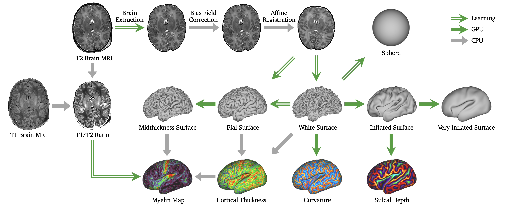

# dHCP Deep Learning-based Neonatal Pipeline

[](https://arxiv.org/abs/2405.08783)
[](https://opensource.org/licenses/Apache-2.0)
[](https://pytorch.org/)

The dHCP deep learning (DL)-based neonatal cortical surface reconstruction pipeline integrates fast and robust DL-based approaches. The pipeline provides

* MRI preprocessing
* Cortical surface reconstruction
* Cortical surface inflation
* Cortical feature estimation
* Spherical projection

for neonatal structural brain MRI processing. The pipeline is accelerated by GPU and only requires ~30 seconds to process a single subject.




## Installation

### Python/PyTorch

The dHCP DL-based neonatal pipeline is based on Python/PyTorch. We recommend installing [Anaconda](https://www.anaconda.com/download) and use ```conda``` to install the dependencies. After installing the Anaconda, you can run 
```
. install.sh
```
to create a new virtual environment ```dhcp``` and install PyTorch as well as other required Python packages in the environment.

Otherwise, if you do not have conda installation, you can run the following command to install the required packages with PyPI.
```
pip install torch==1.13.0+cu116 --extra-index-url https://download.pytorch.org/whl/cu116

pip install tqdm numpy==1.23.5 scipy==1.10.1 nibabel==5.0.1 antspyx==0.3.8
```

### Connectome Workbench

In addition, the Connectome Workbench is required for both pipeline (wb_command) and visualization (wb_view). You can install the [Connectome Workbench](https://www.humanconnectome.org/software/get-connectome-workbench) following the instructions.


## Run Pipeline

The inputs of the dHCP DL-based neonatal pipeline include original T2 and T1 (optional) brain MRI images. The T1 image should be pre-aligned to the T2 MRI. Suppose you have T2 and T1 MRI images in the following directories
```
/YOUR_INPUT_DIR
    /sub1_T2w.nii.gz
    /sub1_T1w.nii.gz
    /sub2_T2w.nii.gz
    /sub3_T2w.nii.gz
    /sub3_T1w.nii.gz
    ...
```

To process all subjects, you can run the pipeline on GPU by
```
python run_pipeline.py --in_dir='/YOUR_INPUT_DIR/' \
                       --out_dir='/YOUR_OUTPUT_DIR/' \
                       --T2='_T2w.nii.gz' \
                       --T1='_T1w.nii.gz' \
                       --sphere_proj='fs' \
                       --device='cuda:0'
```

where ```in_dir``` is the directory containing the input images and ```out_dir``` is the directory to save the output files. ```T2``` and ```T1``` are the suffix of the input T2 and T1 images. ```sphere_proj={'fs','mds'}``` specifies the method of learning-based spherical projection, where ```fs``` simulates the spherical mapping in FreeSurfer, and ```mds``` simulates the Spherical MDS approach used in [original dHCP pipeline](https://github.com/BioMedIA/dhcp-structural-pipeline). The ```device``` tag indicates if the pipeline runs on a GPU or CPU. This command will process all subjects in ```in_dir``` and save your output files (surfaces, spheres, etc.) to
```
/YOUR_OUTPUT_DIR
    /sub1
        /YOUR_OUTPUT_FILES
    /sub2
        /YOUR_OUTPUT_FILES
    /sub3
        /YOUR_OUTPUT_FILES
    ...
```

For the details of all arguments, please run
```
python run_pipeline.py --help
```
