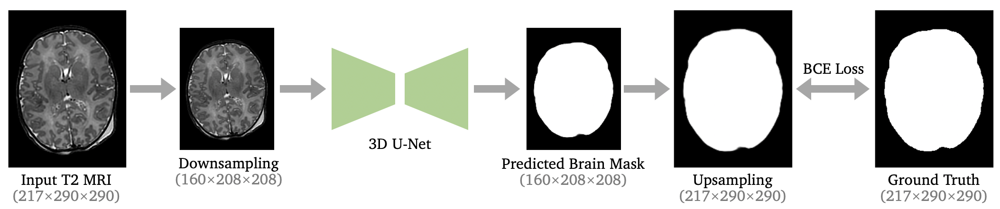
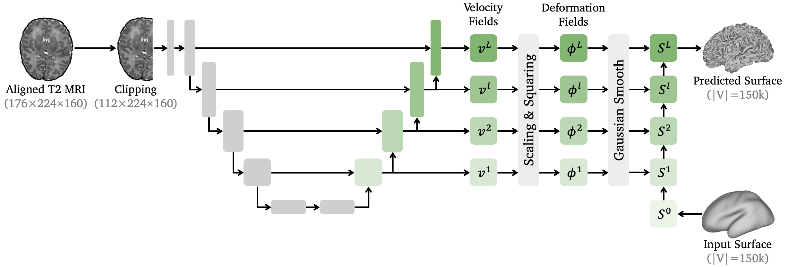
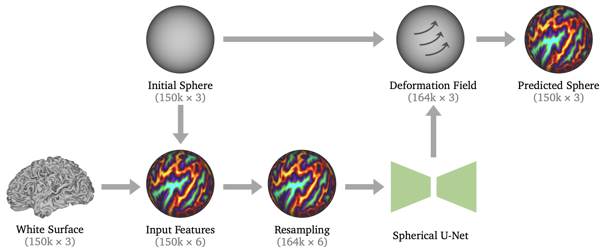

# dHCP Deep Learning-based Neonatal Pipeline

[](https://opensource.org/licenses/Apache-2.0)
[](https://pytorch.org/)
[](https://pytorch3d.org/)

This the **training** instruction for the dHCP deep learning (DL)-based neonatal pipeline.


## Installation

The training of the dHCP DL-based neonatal pipeline is based on ```Python```/```PyTorch```/```PyTorch3D```. We recommend installing [Anaconda](https://www.anaconda.com/download) and use ```conda``` to install the dependencies. After installing the Anaconda, you can run 
```
. install.sh
```
to create a new virtual environment ```dhcp``` and install [PyTorch](https://pytorch.org/), [PyTorch3D](https://pytorch3d.org/), as well as other required Python packages in the environment.


## Data Preprocessing
We preprocess the original dHCP data to create the dataset for training. Assume the original data are in the following directories:
```
/YOUR_DATA
    /sub1
        /sub1_T2w.nii.gz
        /sub1_desc-restore_T2w.nii.gz
        /sub1_desc-brain_mask.nii.gz
        /sub1_desc-drawem9_dseg.nii.gz
        /sub1_hemi-left_pial.surf.gii
        /sub1_hemi-left_wm.surf.gii
        /sub1_hemi-right_pial.surf.gii
        /sub1_hemi-right_wm.surf.gii
    /sub2
        /...
    /sub3
        /...
    /...
```

where ```*_T2w.nii.gz``` is the original T2 brain MRI image, ```*_desc-restore_T2w.nii.gz``` is the bias-corrected T2 image, ```*_desc-brain_mask.nii.gz``` is the brain mask, ```*_desc-drawem9_dseg``` is the brain tissue segmentation generated by Draw-EM, ```*_wm.surf.gii``` and ```*_pial.surf.gii``` are cortical surfaces. The data can be processed by running
```
python preprocess.py --orig_dir='/YOUR_DATA/'\
                     --save_dir='./data/'
```
where ```orig_dir``` is the directory containing the original dHCP data, and  ```save_dir``` is the directory to save the processed data. The preprocessing will randomly split the original dHCP data into training/validation/testing data and save them to ```./data/```, which has the following structure:
```
./data
    /train
        /...
    /valid
        /sub1
            /sub1_T2w_orig_down.nii.gz
            /sub1_T2w_proc_down.nii.gz
            /sub1_brain_mask.nii.gz
            /sub1_ribbon.nii.gz
            /sub1_T2w_proc_affine.nii.gz
            /sub1_hemi-left_pial_150k.surf.gii
            /sub1_hemi-left_wm_150k.surf.gii
            /sub1_hemi-right_pial_150k.surf.gii
            /sub1_hemi-right_wm_150k.surf.gii
        /...
    /test
        /...
```
where ```*_T2w_orig_down.nii.gz``` is the downsampled original T2 image used as the input for learning-based brain extraction, ```*_T2w_proc_down.nii.gz``` is the downsampled, brain-extracted and bias-corrected T2 image used as the input for cortical ribbon segmentation, ```*_brain_mask.nii.gz``` and ```*_ribbon.nii.gz``` are the ground truth brain mask and cortical ribbon mask. ```*_T2w_proc_affine.nii.gz``` is produced by affinely aligning the brain-extracted and bias-corrected T2 image to the dHCP 40-week atlas. It will be used as the input for cortical surface reconstruction. ```*_wm_150k.surf.gii``` and ```*_pial_150k.surf.gii``` are cortical surfaces remeshed to 150k vertices for training.


## Training

### Segmentation
We train 3D U-Nets for brain extraction and cortical ribbon segmentation. The codes for training are included in ```./seg/```. The following figure depicts the learning-based framework for predicting the binary mask of either brain region of interest (ROI) or cortical ribbion.


<p align="center"></p>


#### Brain Extraction
For brain extraction, we can train the U-Net by running
```
cd ./seg
python train.py --seg_type='brain'\
                --tag='YOUR_TAG'\
                --device='cuda:0'\
                --n_epoch=200
```

where ```surf_type```={```brain```, ```ribbon```} is the type of the segmentation, ```tag``` is a string to identify different experiments, and ```n_epoch``` is the total training epochs. The training logs and model checkpoints will be saved to ```./seg/ckpts/```. After training, the model checkpoint with the best validation results will be selected and moved to 
```
./seg/model/model_seg_brain.pt
```


#### Cortical Ribbon
Similarly, for cortical ribbon segmentation we can run
```
cd ./seg
python train.py --seg_type='ribbon'\
                --tag='YOUR_TAG'\
                --device='cuda:0'\
                --n_epoch=200
```
After training, the model checkpoint with the best validation results will be selected and moved to 
```
./seg/model/model_seg_ribbon.pt
```


### Cortical Surface Reconstruction



We propose multiiscale deformation networks to learn a sequence of diffeomorphic deformations for cortical surface reconstruction. The inputs of the neural network include an affinely aligned T2 MRI image ```*_T2w_proc_affine.nii.gz``` and an input surface. The output is a predicted cortical surface. For white surface extraction, the input surface is an initial template surface ```./template/dhcp_week-40_hemi-*_init.surf.gii```. For pial surface extraction, the input surface is the predicted white surface.
The codes for the training are contained in the folder ```./surface/```. We need to train four neural network models for white and pial surfaces for both left and right brain hemispheres. The training requires at least 12GB GPU memory.


#### White Surface
To train the neural network models for white surface reconstruction, please run
```
cd ./surface
python train.py --surf_type='wm'\
                --surf_hemi='left'\
                --tag='YOUR_TAG'\
                --device='cuda:0'\
                --n_epoch=200\
                --sigma=1.0\
                --w_nc=3.0\
                --w_edge=0.3
```
where ```surf_type```={```wm```, ```pial```} is the type of the surfaces, ```surf_hemi```={```left```,```right```} is the brain hemisphere, ```tag``` is a string to identify different experiments, ```n_epoch``` is the total training epochs, ```sigma``` is the standard deviation for Gaussian smoothing, ```w_nc``` is the weight of the normal consistency loss, and ```w_edge``` is the weight of the edge length loss.

All model checkpoints and training logs are saved to ```./surface/ckpts/```. After training, we select the model checkpoints with the best validation results and move them to 
```
./surface/model/model_hemi-left_wm.pt
./surface/model/model_hemi-right_wm.pt
```


#### Pial Surface
Similarly, to train the models for pial surface reconstruction, please run
```
cd ./surface
python train.py --surf_type='pial'\
                --surf_hemi='left'\
                --tag='YOUR_TAG'\
                --device='cuda:0'\
                --n_epoch=200\
                --sigma=1.0\
                --w_nc=3.0\
                --w_edge=0.3
```

After training, please move the best model checkpoints to 
```
./surface/model/model_hemi-left_pial.pt
./surface/model/model_hemi-right_pial.pt
```


### Spherical Projection

<p align="center"></p>

For spherical projection, we train a Spherical U-Net to learn a diffeomorphic deformation field to deform an initial surface. The metric distortions are minimized between the predcited deformed sphere and the white surface. The codes for training spherical projection are in the ```./sphere/``` folder. We can run the following code to train the Spherical U-Net:
```
cd ./sphere
python train.py --surf_hemi='left'\
                --tag='YOUR_TAG'\
                --device='cuda:0'\
                --n_epoch=200\
                --w_edge=1.0\
                --w_area=0.5
```
where ```surf_hemi```={```left```,```right```} is the brain hemisphere, ```w_edge``` and ```w_area``` are the weights for the edge and area distortion loss. After training, we move the best model checkpoints to 
```
./sphere/model/model_hemi-left_sphere.pt
./sphere/model/model_hemi-right_sphere.pt
```
